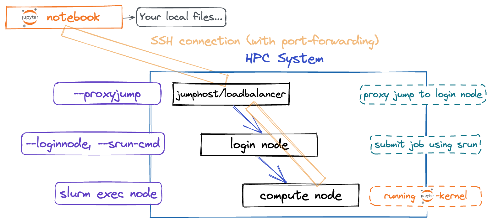
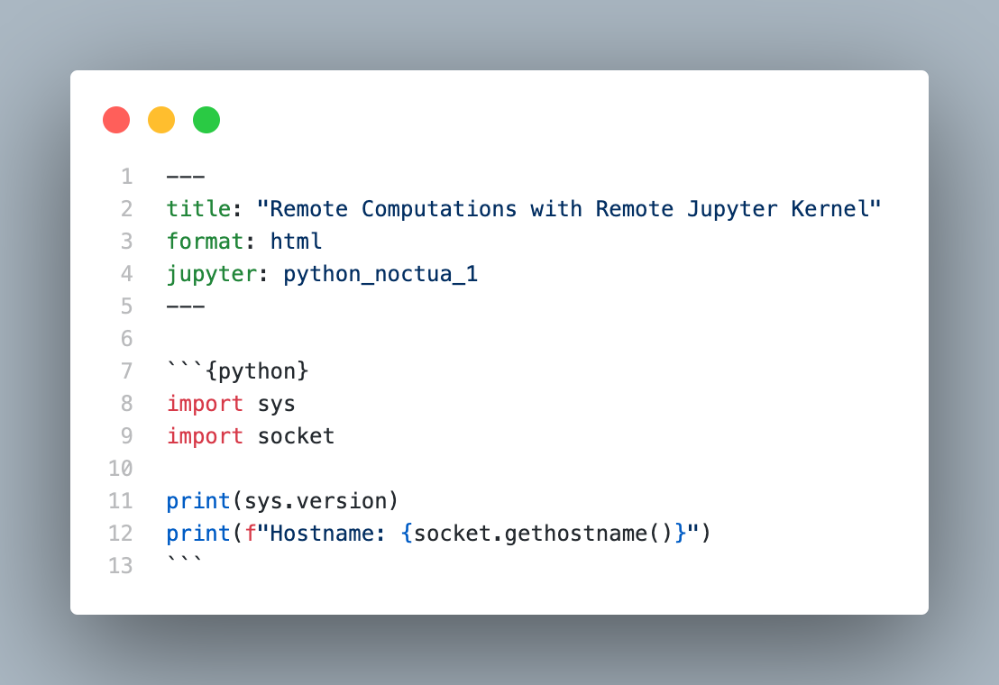

# Slurm Jupyter Kernel

Manage (create, list, modify and delete) and starting jupyter slurm kernels using srun

slurmkernel is able to connect to a kernel started on a compute node using SSH port forwarding.
You can specify a SSH proxy jump, if you have to jump over two hosts (e.g. a loadbalancer)



## Features & Use-Cases

* Start Remote Jupyter kernel using srun (Slurm)
  * Access to your local filesystem with remote code execution
* Manage existing Slurm Jupyter kernel
* Use the template module to use pre-defined script templates for remote installation and local kernel creation
* Custom environment variables supported (e.g. JULIA_NUM_THREADS)
  * Environment variables will be sent to session before starting the kernel

## Table of Contents

- [Slurm Jupyter Kernel](#slurm-jupyter-kernel)
  - [Features \& Use-Cases](#features--use-cases)
  - [Table of Contents](#table-of-contents)
  - [Installation](#installation)
    - [Install using pip](#install-using-pip)
  - [Requirements for usage](#requirements-for-usage)
  - [Create a new kernel](#create-a-new-kernel)
    - [Template module (Script templates)](#template-module-script-templates)
      - [Example](#example)
    - [IPython Example](#ipython-example)
      - [Remote Host](#remote-host)
      - [Localhost](#localhost)
    - [Set kernel-specific environment](#set-kernel-specific-environment)
  - [Using the kernel with Quarto](#using-the-kernel-with-quarto)
    - [Example](#example-1)
  - [Get help](#get-help)

## Installation

`slurm_jupyter_kernel` must be installed locally where the Jupyter notebooks will run.

### Install using pip

```bash
python3 -m pip install slurm_jupyter_kernel
```

## Requirements for usage

* SSH-Key based authentication

You need a running SSH agent with the loaded key file to access the loginnode without a password.

## Create a new kernel

We assume to install the Jupyter kernel tools into your `$HOME` directory on your cluster.

### Template module (Script templates)

With `$ slurmkernel template {list, use, add, edit}` you can use pre-defined script templates to initialize your remote environment (IJulia, IPython, ...), add new script templates or edit existing templates.

If you want to create your own script templates, see here: [Create Script Templates](wiki/Create-Template-Scripts)

#### Example

```bash
$ slurmkernel template use --proxyjump lb.hpc.pc2.de --loginnode login001 --user hpcuser1 --template ipython
````

You will be interactively asked for the required information if you do not pass any arguments when calling `slurmkernel template use`

### IPython Example

#### Remote Host

1. load required software (if necessary)
2. Create a Python virtual environment
3. Install the IPython package (ipython, ipykernel)
4. Create a wrapper script and mark it as executable

```bash
remotehost ~$ module load lang Python
remotehost ~$ python3 -m venv remotekernel/
remotehost ~$ source remotekernel/bin/activate
(remotekernel) remotehost ~$ python3 -m pip install ipython ipykernel; deactivate
remotehost ~$ echo -e '#!/bin/bash\nmodule load lang Python\n\nsource remotekernel/bin/activate\n"$@"' > remotekernel/ipy_wrapper.sh && chmod +x remotekernel/ipy_wrapper.sh
```

#### Localhost

5. Kernel Remote Slurm kernel with command `slurmkernel`

```bash
notebook ~$ slurmkernel create --displayname "Python 3.8.2" \
--slurm-parameter="account=slurmaccount,time=00:30:00,partition=normal" \
--kernel-cmd="\$HOME/remotekernel/ipy_wrapper.sh ipython kernel -f {connection_file}" \
--proxyjump="lb.n1.pc2.uni-paderborn.de" \
--loginnode="login-0001" \
--language="python"
```


### Set kernel-specific environment

If you want to set kernel specific environment variables (e.g. `JULIA_NUM_THREADS` for the number of threads) just extend the jupyter kernelspec file with `env`.

Parameter for `slurmkernel`:

`--environment="JULIA_NUM_THREADS=4"`

More information here: https://jupyter-client.readthedocs.io/en/stable/kernels.html

## Using the kernel with Quarto

What is Quarto?

https://quarto.org/

* Install kernel as shown above 
  *  Make sure that you pass the `--language` flag as well.
     *  e.g. `python` or `julia`

### Example


## Get help

```bash
$ slurmkernel --help

usage: Tool to manage (create, list, modify and delete) and starting jupyter slurm kernels using srun [-h] [--version] {create,list,edit,delete,template} ...

positional arguments:
  {create,list,edit,delete,template}
    create              create a new slurm kernel
    list                list available slurm kernel
    edit                edit an existing slurm kernel
    delete              delete an existing slurm kernel
    template            manage script templates (list, use, add, edit)

optional arguments:
  -h, --help            show this help message and exit
  --version             show program's version number and exit

```
