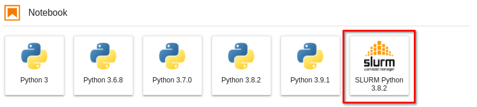

# Slurm Jupyter Kernel

Create jupyter kernels and run kernels using srun

Jupyter Notebook/JupyterHub should have direct access to the compute nodes, so it is a good idea to install JupyterHub on a front end of the HPC system.

If you are an HPC user, you can also install the Python packages `notebook` and `slurm_jupyter_kernel` with the prefix `--user` into your home directory.

slurmkernel is able to connect to a kernel started on a compute node using SSH port forwarding.
To allow users to access the compute node without a password, the following PAM module should have been configured:

https://slurm.schedmd.com/pam_slurm_adopt.html

## Installation

### Install using pip

```bash
python3 -m pip install slurm_jupyter_kernel
```

## Create SSH keyfile

```bash
mawi $ ssh-keygen                
Generating public/private rsa key pair.
Enter file in which to save the key (/home/mawi/.ssh/id_rsa): /home/mawi/.ssh/slurmjupyterkernel     
Enter passphrase (empty for no passphrase): 
Enter same passphrase again: 
Your identification has been saved in /home/mawi/.ssh/slurmjupyterkernel
Your public key has been saved in /home/mawi/.ssh/slurmjupyterkernel.pub
```

## Create a new kernel

### Get help

```bash
$ slurmkernel --help

usage: Adding jupyter kernels using slurm [-h] {create} ...

positional arguments:
  {create}
    create    create a new slurm kernel

optional arguments:
  -h, --help  show this help message and exit

```

### Example

```bash
$ slurmkernel create --displayname="Python 3.8.4" --keyfile ~/.ssh/slurmjupyterkernel --account=hpc-group --time=00:30:00 --kernel-cmd="python3 -m ipykernel_launcher -f {connection_file}" --partition=batch

Try to create new jupyter slurm kernel "Python 3.8.4" ...
{
  "argv": [
    "/usr/bin/python3",
    "-m",
    "slurm_jupyter_kernel",
    "--partition",
    "batch",
    "--account",
    "hpc-group",
    "--time",
    "00:30:00",
    "--kernel-cmd",
    "python3 -m ipykernel_launcher -f {connection_file}",
    "--connection-file",
    "{connection_file}"
  ],
  "display_name": "SLURM Python 3.8.4"
}

Successfully created kernel "SLURM Python 3.8.4" :-)

```


